### CHAPTER 7 합셩곱 신경망(CNN)
#### 7.1 전체 구조
* Affine 계층으로 이뤄진 네트워크
    
* CNN으로 이뤄진 네트워크
    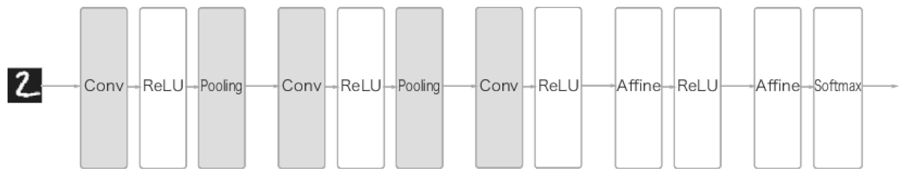
    - 합셩곱 계층(convolutional layer)
    - 폴링 계층(pooling layer)
#### 7.2 합성곱 계층
##### 7.2.1 완전연결 게층의 문제점
* 완전연결 계층은 데이터의 형상 무시(1차원으로 처리)
* 합성곱 계층은 형상 유지
* 합성곱 계층의 입출력 데이터를 `특징 맵(feature map)`이라 부름
    
##### 7.2.2 합성곱 연산
* 필터 연산
    - 커널이라고도 부름
    - 완전연결 계층의 가중치
    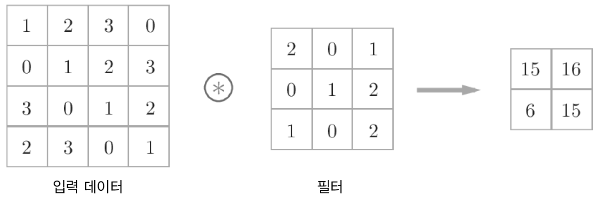
* 합성곱 연산의 계산 순서
    
* 합성곱 연산의 편향
    
##### 7.2.3 패딩
* 출력 크기를 조정할 목적으로 사용
* 입력 데이터 주변을 특정 값(0)으로 채움
    
##### 7.2.4 스트라이드
* 필터를 적용하는 위치의 간격
    
* 출력 크기 계산
    - 입력 크기(H, W)
    - 필터 크기(FH, FW)
    - 출력 크기(OH, OW)
    - 패딩(P)
    - 스트라이드(S)
    
##### 7.2.5 3차원 데이터의 합성곱 연산
* 3차원 데이터의 합성곱 연산
    - 입력 데이터와 필터의 합성곱 연상을 채널마다 수행
    - 결과를 더해 하나의 출력을 얻음
    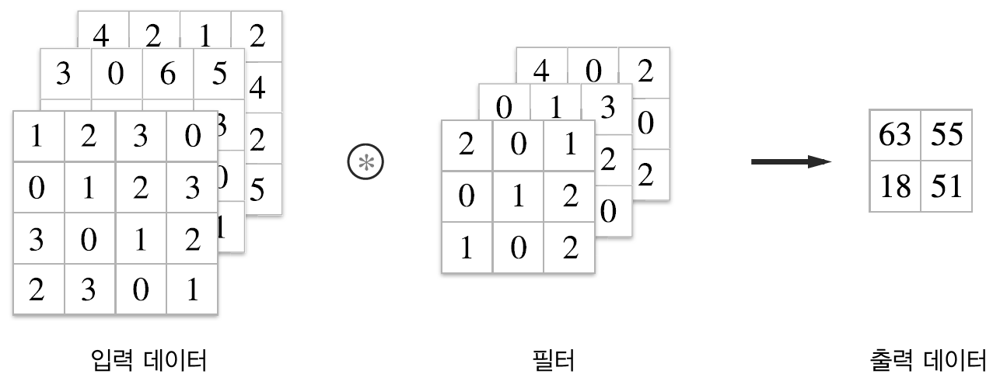
    - 3차원 데이터 합성곱 연산 계산 순서
    
##### 7.2.6 블록으로 생각하기
* 채널 수 C, 높이 H, 너비 W의 형상 = (C, H, W)
* 채널 수 C, 필터 높이 FH, 필터 너비 FW = (C, FH, WH)
    
    - 출력데이터는 한 장의 특징 맵
    - 합셩곱 연산의 출력으로 다수의 채널을 내보려내려면?
        - 필터(가중치)를 다수 사용하는 것
* 다수의 필터를 사용한 합성곱의 예
    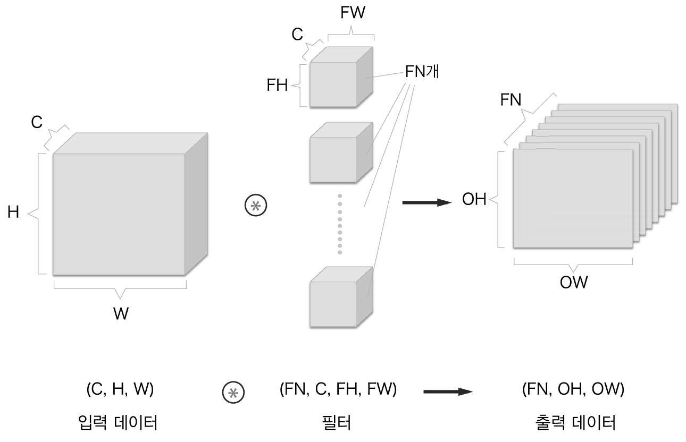
* 편향 처리
    
    - 편향의 형상은 (FN, 1, 1)
    - 편향은 넘파이의 브로드캐스트 기능으로 구현
##### 7.2.7 배치 처리
* (데이터 수, 채널 수, 높이, 너비) = (N, C, H, W)
    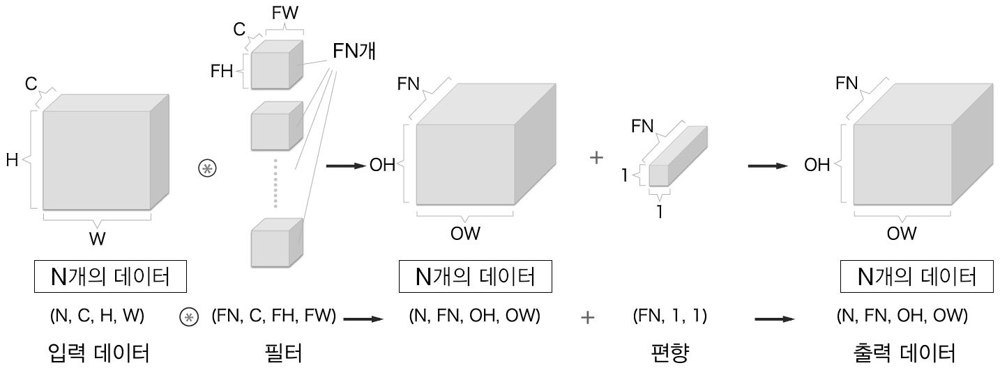

#### 7.3 풀링 계층
* 세로, 가로의 공간을 줄이는 연산
    
    - 2*2 max pooling
##### 7.3.1 풀링 계층의 특징
* 학습해야 할 매개변수가 없다
* 채널 수가 변하지 않는다.
    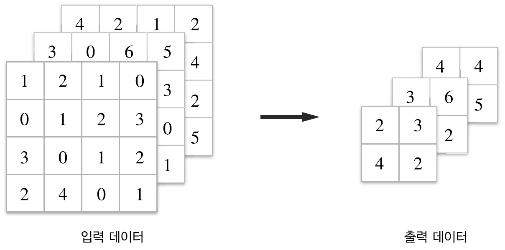
* 입력의 변화에 영향을 적게 받는다(강건하다)
    - 입력 데이터가 조금 변해도 풀링의 결과는 잘 변하지 않음
    
#### 7.4 합성곱/풀링 계층 구현하기
##### 7.4.1 4차원 배열
* 데이터의 형상이 (10, 1, 28, 28) 예제
    ```
    x = np.random.rand(10, 1, 28, 28)
    ```
##### 7.4.2 im2col로 데이터 전개하기
* 4차원 대신 2차원으로 변환하여 연산처리
    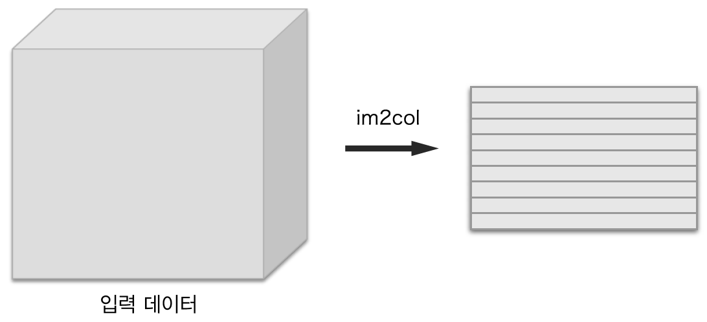
* 필터를 적용되는 영역을 한줄로 늘여서 처리
    - 아래 그리은 스트라이드시 겹치지 않았을때 그림
    
    - 스트라이드는 보통 겹치므로 im2col 작업시엔 메모리를 많이 사용함
* im2col을 적용했을때 적용되는 과정
    
    - im2col로 차원 변형 -> 합성곱 -> reshape
##### 7.4.3 합성곱 계층 구현하기
* im2col 함수의 인터페이스
    ```
    im2col(input_data, filter_h, filter_w, stride=1, pad=0)
    ```
* 합성곱 계층 Convolution 클래스
    ```
    class Convolution:
        def __init__(self, W, b, stride=1, pad=0):
            self.W = W
            self.b = b
            self.stride = stride
            self.pad = pad
        def forward(self, x):
            FN, C ,FH, FW = self.W.shape
            N, C, H, W = x.shape
            out_h = int( 1 + (H + 2*self.pad - FH) / self.stride )
            out_w = int( 1 + (W + 2*self.pad - FW) / self.stride )
            
            col = im2col(x, FH, FW, self.stride, self.pad)
            col_W = self.W.reshape(FN, -1).T
            out = np.dot(col, col_W) + self.b
  
            out = out.reshape(N, out_h, out_w, -1).transpose(0, 3, 1, 2)
            return out
    ```
    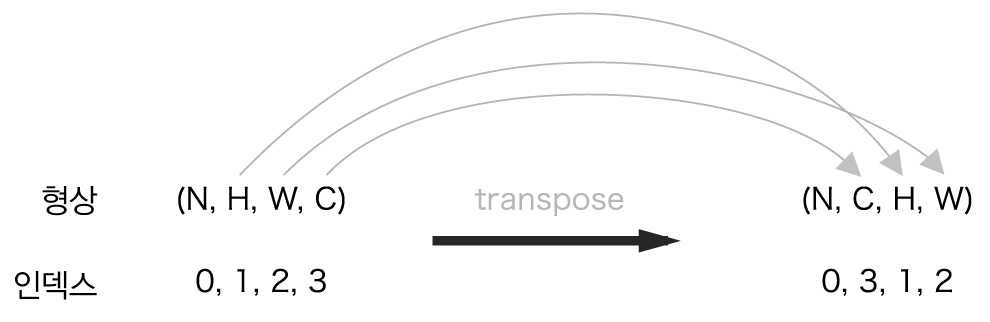
##### 7.4.4 풀링 계층 구현하기
    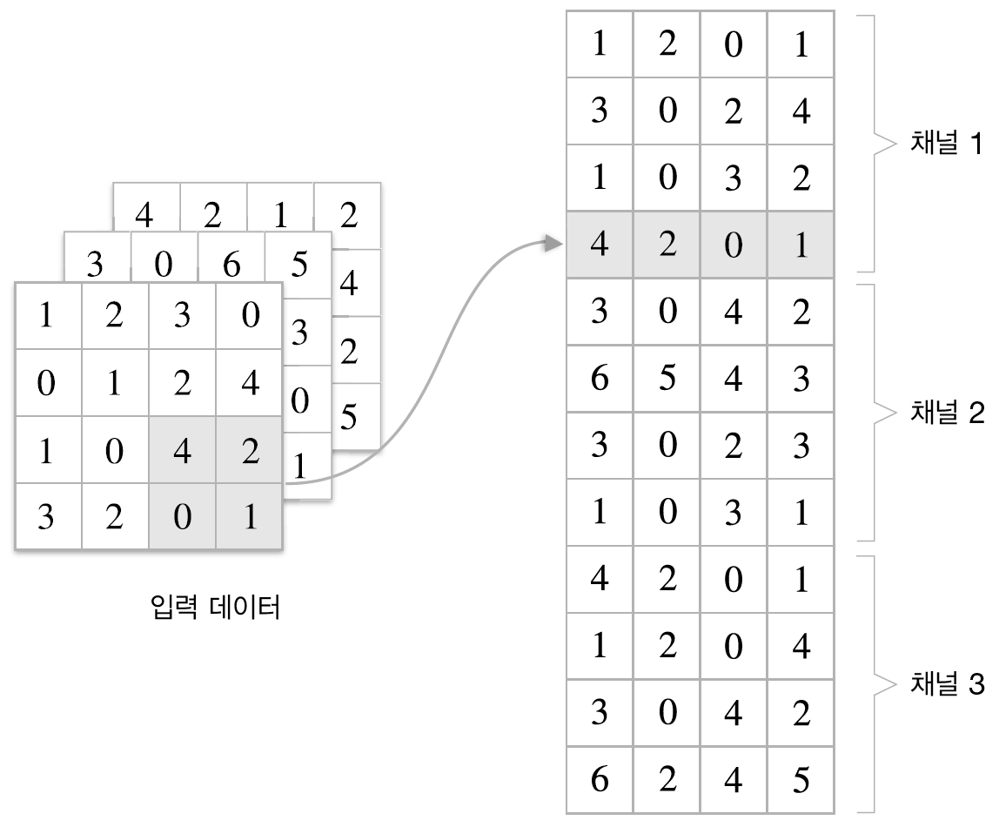
    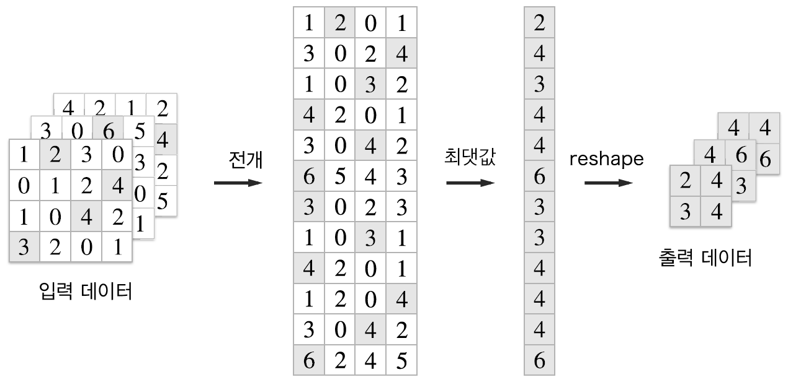

#### 7.5 CNN 구현하기
    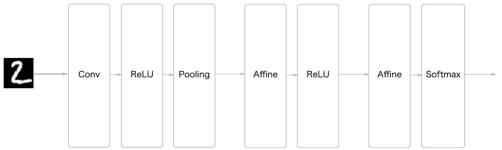

#### 7.6 CNN 시각화하기
##### 7.6.1 1번째 층의 가중치 시각화하기
    
    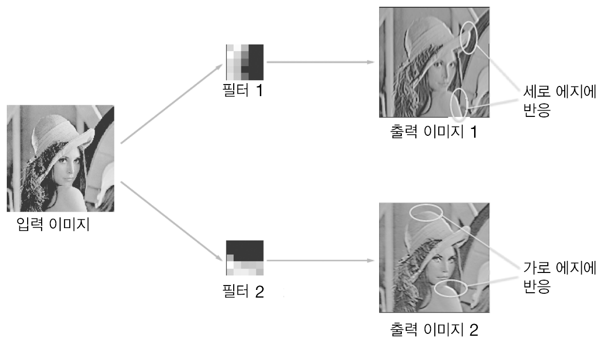
##### 7.6.2 층 깊이에 따른 추출 정보 변화
    
#### 7.7 대표적인 CNN
##### 7.7.1 LeNet
    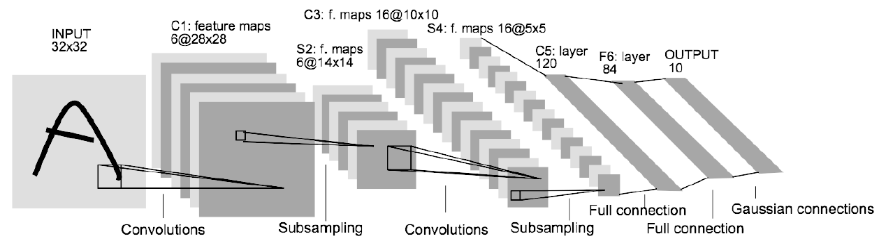
##### 7.7.2 AlexNet
    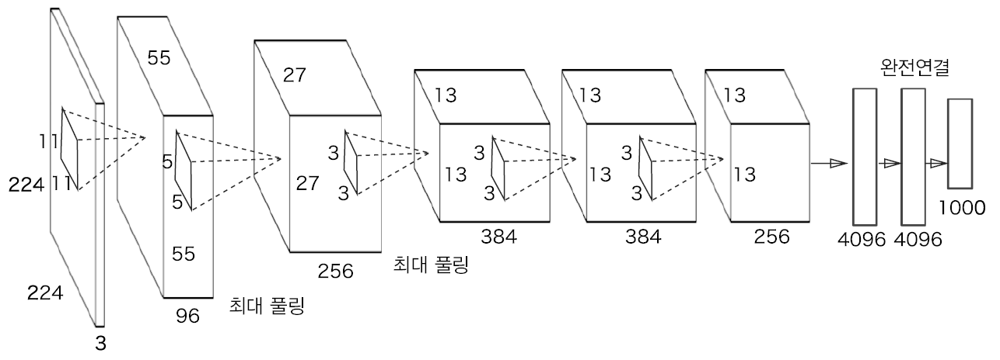
#### 7.8 정리
    