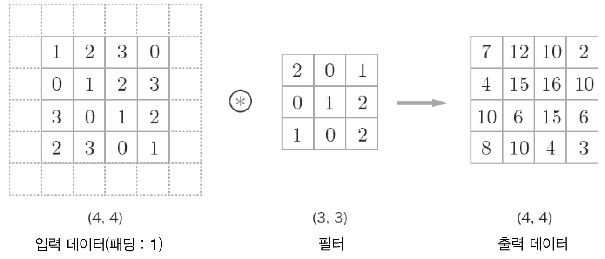
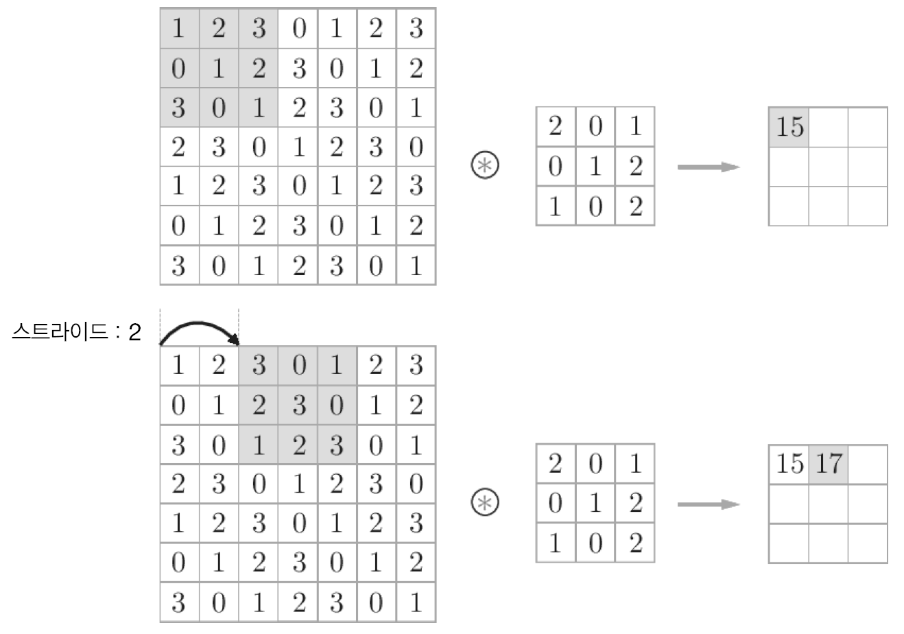
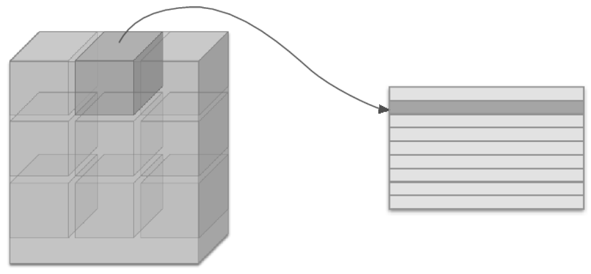
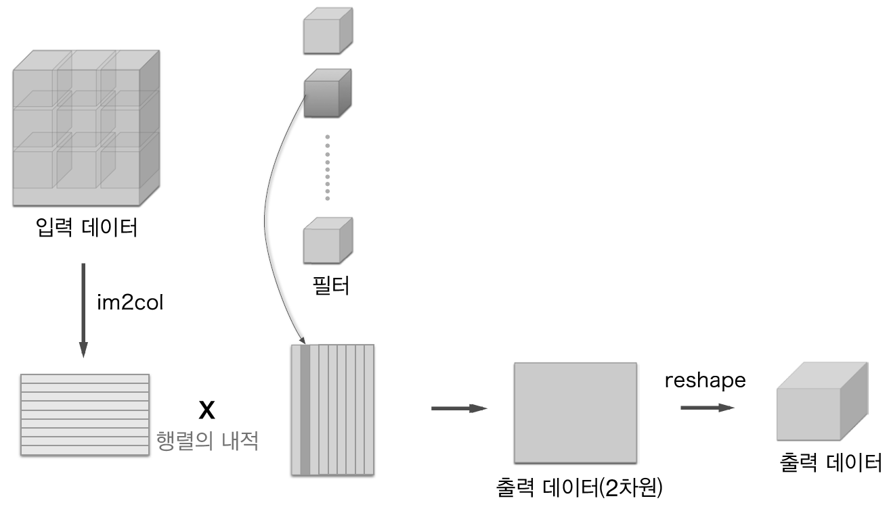

### CHAPTER 7 합셩곱 신경망(CNN)
#### 7.1 전체 구조
* Affine 계층으로 이뤄진 네트워크
    
* CNN으로 이뤄진 네트워크
    
    - 합셩곱 계층(convolutional layer)
    - 폴링 계층(pooling layer)
#### 7.2 합성곱 계층
##### 7.2.1 완전연결 게층의 문제점
##### 7.2.2 합성곱 연산
    
    
    
##### 7.2.3 패딩
    
##### 7.2.4 스트라이드
    
    
##### 7.2.5 3차원 데이터의 합성곱 연산
    
    
##### 7.2.6 블록으로 생각하기
    
    
    
##### 7.2.7 배치 처리
    

#### 7.3 풀링 계층
    
##### 7.3.1 풀링 계층의 특징
    
    
#### 7.4 합성곱/풀링 계층 구현하기
##### 7.4.1 4차원 배열
##### 7.4.2 im2col로 데이터 전개하기
    
    
    
##### 7.4.3 합성곱 계층 구현하기
    
##### 7.4.4 풀링 계층 구현하기
    
    

#### 7.5 CNN 구현하기
    

#### 7.6 CNN 시각화하기
##### 7.6.1 1번째 층의 가중치 시각화하기
    
    
##### 7.6.2 층 깊이에 따른 추출 정보 변화
    
#### 7.7 대표적인 CNN
##### 7.7.1 LeNet
    
##### 7.7.2 AlexNet
    
#### 7.8 정리
    